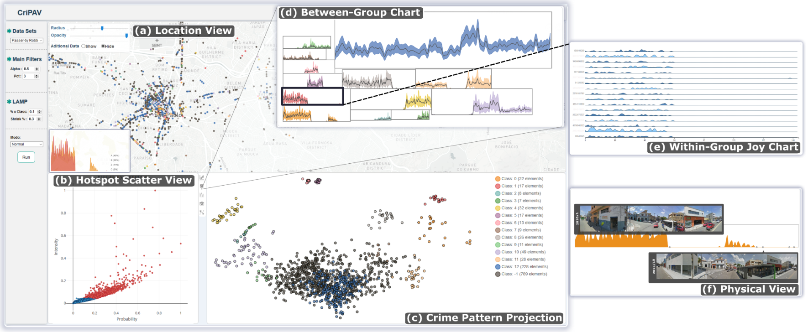

## Adaptation of "CriPAV: Street-Level Crime Patterns Analysis and Visualization" to a Jupyter environment

This project is based on [Cookiecutter Widgets](https://github.com/jupyter-widgets/widget-cookiecutter). It requires Python, Cookiecutter, and npm to install. This will install CriPAV as a Python module.

### Installation Steps
1. **Step 1**: Activate your desired conda environment for installation of the module.
2. **Step 2**: Navigate to`jupyter_d3_widget/` and run `pip install -e .`
3. **Step 3**: Run `jupyter nbextension install --py --symlink --sys-prefix jupyter_d3_widget`
4. **Step 4**: Run `jupyter nbextension enable --py --sys-prefix jupyter_d3_widget`
5. **Step 5**: Create a notebook with your selected environment and import the module as shown in the image below.

### Original CriPAV

### Adapted Version

### Project Demonstration Videos
 - [Watch on Google Drive](https://drive.google.com/file/d/1TcZFP87l-OA3MovFuPiR2rOsy23tNCKx/view?usp=sharing)
 - [Watch on Google Drive](https://drive.google.com/file/d/10tpVIuyv5a9JF82wh-yYYxX4m2t4xYiN/view?usp=sharing)
 - [Watch on Google Drive](https://drive.google.com/file/d/17qIE140RlUe4LtGlUT078fDvBaZmeOY-/view?usp=sharing)

### Source paper

G. García-Zanabria et al., "CriPAV: Street-Level Crime Patterns Analysis and Visualization," in IEEE Transactions on Visualization and Computer Graphics, vol. 28, no. 12, pp. 4000-4015, 1 Dec. 2022, doi: 10.1109/TVCG.2021.3111146.

